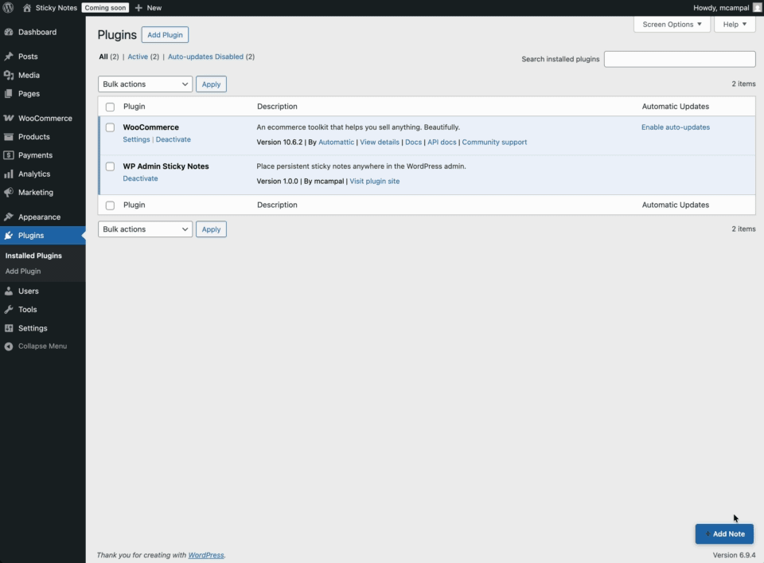

# Admin Sticky Notes

Place persistent sticky notes anywhere in the WordPress admin — anchored to specific page elements, visible to your whole team.

---

## Why this exists

When you manage a WordPress site with a team, there's no good place to leave a contextual note right where it matters — on the screen, next to the thing you're talking about. You end up in Slack, or a shared doc, or a sticky note on a physical monitor that only you can see.

This plugin lets you pin notes directly onto any wp-admin page, anchored to a specific element. Your colleagues see them the next time they visit that page.

---

## Installation

1. Download the repository as a ZIP (click **Code → Download ZIP** above)
2. In your WordPress admin, go to **Plugins → Add New → Upload Plugin**
3. Upload the ZIP and click **Install Now**
4. Click **Activate**

No build step. No Composer. No npm. Just activate and it works.

**Requirements:** WordPress 6.0+, PHP 8.0+. Compatible with WooCommerce.

---

## Usage

Once activated, a **➕ Add Note** button appears in the bottom-right corner of every admin page.

1. Click **➕ Add Note**
2. Click any element on the page to anchor your note to it
3. Write your note, pick a colour, click **Save**
4. The note appears on that page for all users

Notes can be dragged to reposition them. The new position is saved automatically.

---

## Who can see notes

Any logged-in WordPress user can see notes on the pages they visit. Users can dismiss a note (hide it for themselves) without deleting it — other users will still see it.

## Who can manage notes

**Administrators only** can create, edit, and delete notes. This applies both in the UI and at the API level.

A full list of all notes is available under **Settings → Sticky Notes**.

---

## Note colours

| Colour | Suggested use |
|--------|--------------|
| 🟡 Yellow | General notes |
| 🔴 Red | Warnings or things not to touch |
| 🟢 Green | Good to go / approved |
| 🔵 Blue | Informational |

---

## License

GPL-2.0-or-later
